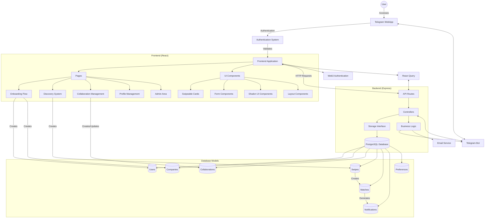

# Web3 Professional Networking Platform Architecture

Below is a Mermaid chart showing how the application works:

## Application Flow

1. **User Authentication**:
   - User accesses the application through Telegram WebApp
   - Authentication system validates the user via Telegram WebApp initialization data
   - Application maintains persistent authentication using a multi-layered approach

2. **Onboarding Process**:
   - New users go through a step-by-step onboarding process
   - User profile and company information are collected
   - Preferences for collaboration types and interests are set

3. **Core Functionality**:
   - **Discovery System**: Users swipe on collaboration opportunities
   - **Collaboration Management**: Users create and manage their own collaborations
   - **Match Management**: Users interact with matches
   - **Profile Management**: Users update their profiles and preferences

4. **Data Flow**:
   - Frontend communicates with backend through API endpoints
   - Backend validates requests and processes data
   - Data is stored in PostgreSQL database
   - Real-time updates are delivered via notifications

5. **Web3 Integration**:
   - Application uses blockchain technology for enhanced privacy
   - Users can connect with Web3 wallets
   - Smart contract interactions for verifiable credentials

## Technology Stack

- **Frontend**: React, Shadcn/UI, TailwindCSS, React Query, Framer Motion
- **Backend**: Node.js, Express, TypeScript
- **Database**: PostgreSQL with Drizzle ORM
- **Authentication**: Telegram WebApp authentication with fallback mechanisms
- **Web3**: Blockchain integration for privacy-focused identity