# Web3 Professional Networking Platform Data Model

Below is a Mermaid entity-relationship diagram showing the database structure:

```mermaid
erDiagram
    USERS {
        uuid id PK
        string telegram_id
        string first_name
        string last_name
        string username
        string email
        string handle
        string job_title
        boolean is_admin
        boolean is_approved
        string linkedin_url
        string twitter_url
        string twitter_followers
        timestamp applied_at
        timestamp created_at
        string referral_code
    }
    
    COMPANIES {
        uuid id PK
        uuid user_id FK
        string name
        string website
        string logo_url
        string description
        string sector
        string funding_stage
        string employee_count
        string location
        boolean has_token
        timestamp created_at
    }
    
    COLLABORATIONS {
        uuid id PK
        uuid user_id FK
        string title
        string description
        jsonb details
        string collab_type
        string status
        timestamp created_at
        timestamp updated_at
    }
    
    SWIPES {
        uuid id PK
        uuid user_id FK
        uuid collaboration_id FK
        string direction
        string note
        jsonb details
        timestamp created_at
    }
    
    MATCHES {
        uuid id PK
        uuid collaboration_id FK
        uuid user_id FK
        string note
        string status
        timestamp created_at
    }
    
    COLLAB_NOTIFICATIONS {
        uuid id PK
        uuid user_id FK
        uuid collaboration_id FK
        string type
        string content
        boolean is_read
        boolean is_sent
        timestamp created_at
    }
    
    NOTIFICATION_PREFERENCES {
        uuid id PK
        uuid user_id FK
        boolean email_enabled
        boolean telegram_enabled
        timestamp created_at
    }
    
    MARKETING_PREFERENCES {
        uuid id PK
        uuid user_id FK
        array collab_types
        array topics
        array company_sectors
        string company_followers_min
        string user_followers_min
        array funding_stages
        boolean has_token
        array blockchain_networks
        timestamp created_at
    }
    
    USERS ||--o{ COMPANIES : "has"
    USERS ||--o{ COLLABORATIONS : "creates"
    USERS ||--o{ SWIPES : "performs"
    USERS ||--o{ MATCHES : "receives"
    USERS ||--o{ COLLAB_NOTIFICATIONS : "receives"
    USERS ||--|| NOTIFICATION_PREFERENCES : "has"
    USERS ||--|| MARKETING_PREFERENCES : "has"
    
    COLLABORATIONS ||--o{ SWIPES : "receives"
    COLLABORATIONS ||--o{ MATCHES : "creates"
    COLLABORATIONS ||--o{ COLLAB_NOTIFICATIONS : "generates"
```

## Key Entity Relationships

### 1. User-Centric Relationships
- Each **User** has one **Company** profile
- Each **User** can create multiple **Collaborations**
- Each **User** has specific **Notification Preferences**
- Each **User** has specific **Marketing Preferences** (used for discovery filters)

### 2. Collaboration Relationships
- Each **Collaboration** is created by one **User**
- Each **Collaboration** can receive multiple **Swipes** from different users
- When a match occurs, a **Match** record is created
- Each matching action can generate **Notifications**

### 3. Interaction Relationships
- **Swipes** connect **Users** with **Collaborations** (indicating interest or pass)
- **Matches** represent successful connections between users' collaborations
- **Notifications** keep users informed about new matches and updates

## Data Flow Examples

### Example 1: User Creates a Collaboration
1. Data is inserted into the **Collaborations** table
2. The collaboration becomes visible in discovery for other users with matching preferences

### Example 2: User Swipes Right on a Collaboration
1. Data is inserted into the **Swipes** table (direction = "right")
2. System checks if the collaboration owner had previously swiped right on one of the user's collaborations
3. If a match exists, data is inserted into the **Matches** table
4. A notification is generated in the **Collab_Notifications** table