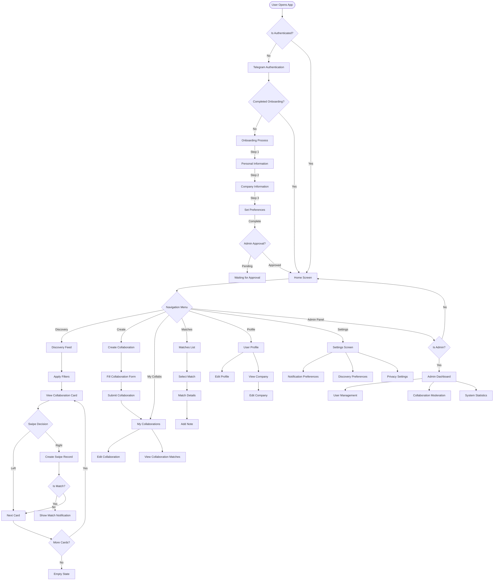

# Web3 Professional Networking Platform User Flow

Below is a Mermaid chart showing the typical user journey through the application:

## Key User Journeys

### 1. New User Journey
- Authentication via Telegram
- Complete onboarding process (personal info, company info, preferences)
- Wait for admin approval
- Access main application features

### 2. Discovery Journey
- Navigate to discovery feed
- Apply filters (collaboration types, topics, company sectors, etc.)
- View and swipe on collaboration cards
- Receive match notifications when both parties express interest
- View match details and add notes

### 3. Collaboration Creation Journey
- Create new collaboration opportunity
- Fill in collaboration details (type, description, requirements)
- Submit collaboration
- Manage created collaborations
- View and interact with matches

### 4. Profile Management Journey
- View and edit personal profile
- Update company information
- Manage notification preferences
- Adjust discovery preferences

### 5. Admin User Journey
- Access admin dashboard
- Approve/reject new user applications
- Moderate collaboration content
- View system statistics and reports